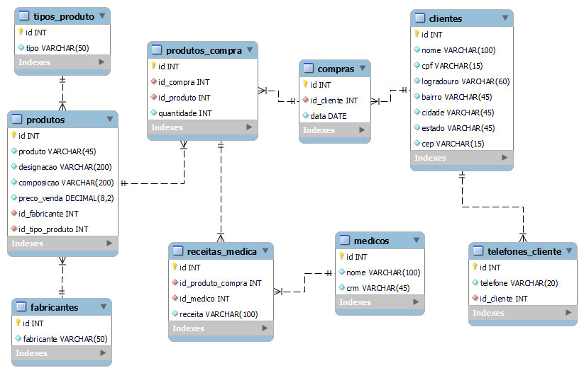

# Banco de Dados para farmácia


Este repositório existe somente para fins de estudo. Será implementado também para estudo do Git Flow.

Banco de Dados para Farmácia implementado no MySQL Workbench

```mysql
SELECT * FROM conhecimentos_mysql;
```



---

#### Contato:

[LinkedIn](https://www.linkedin.com/in/eeddyyxxyy/ "Para contato profissional")

[Currículo Online](https://eddyyxxyy.github.io/#home "Realizado no curso de Git e Github: Essencial")
